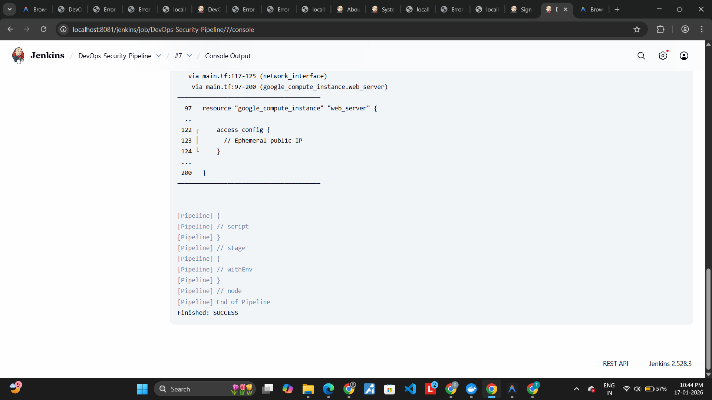
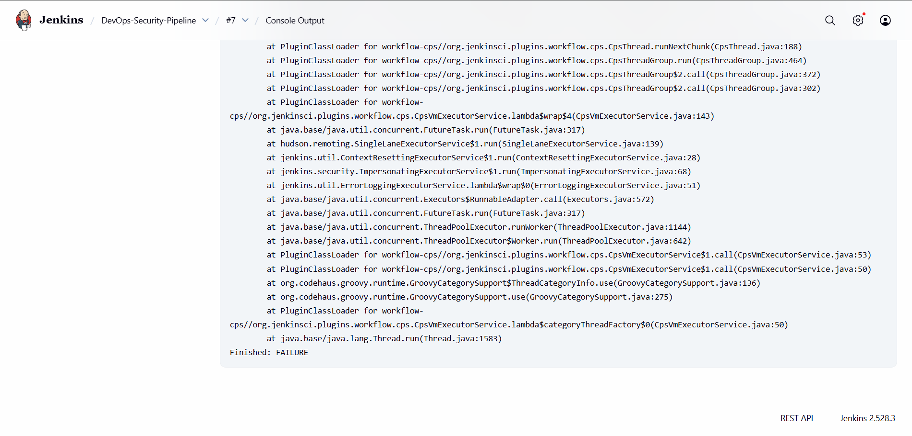
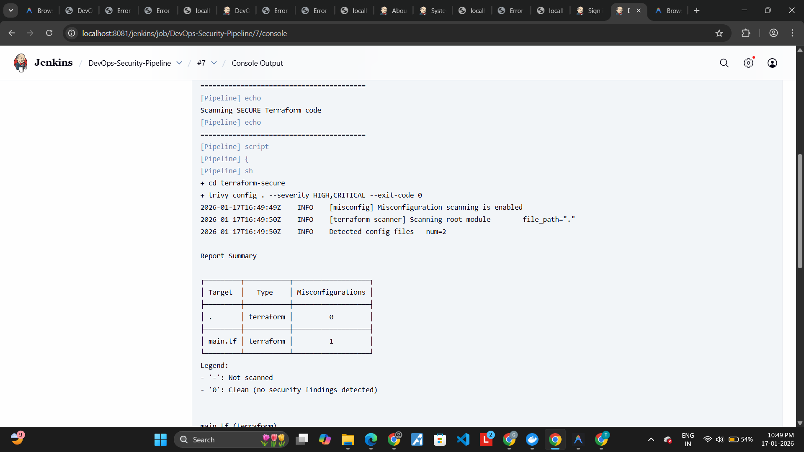
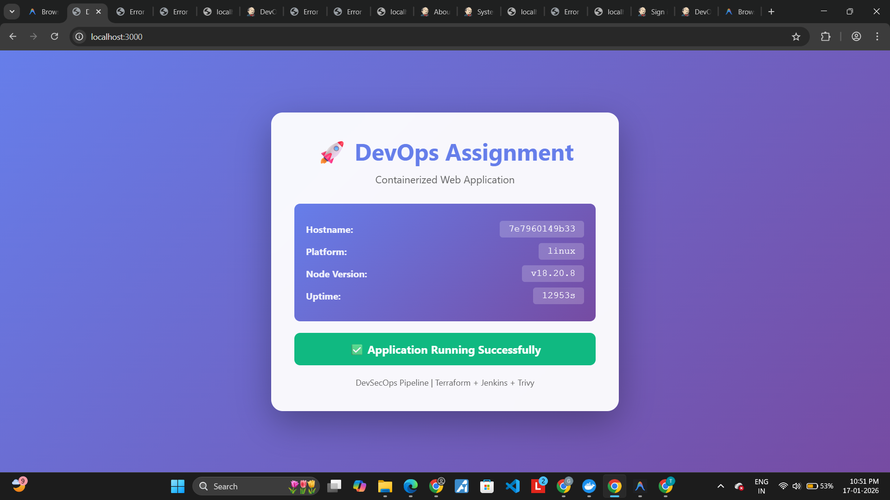

# DevOps Assignment - DevSecOps Pipeline Project

[](https://www.jenkins.io/)
[](https://www.terraform.io/)
[](https://cloud.google.com/)
[](https://www.docker.com/)
[](https://trivy.dev/)

A comprehensive DevSecOps project demonstrating infrastructure as code, containerization, CI/CD pipeline automation, and AI-driven security remediation.

## 📋 Table of Contents

- [Project Overview](#project-overview)
- [Architecture](#architecture)
- [Technologies Used](#technologies-used)
- [Prerequisites](#prerequisites)
- [Quick Start](#quick-start)
- [Detailed Setup](#detailed-setup)
- [Jenkins Pipeline](#jenkins-pipeline)
- [Security Scanning](#security-scanning)
- [AI-Driven Remediation](#ai-driven-remediation)
- [Deployment](#deployment)
- [Screenshots](#screenshots)
- [Video Demo](#video-demo)
- [Troubleshooting](#troubleshooting)

## 🎯 Project Overview

This project implements a complete DevSecOps workflow that:

1. **Containerizes** a Node.js web application using Docker
2. **Provisions** cloud infrastructure on GCP using Terraform
3. **Automates** security scanning and deployment using Jenkins
4. **Identifies** security vulnerabilities using Trivy
5. **Remediates** security issues using AI-powered analysis

### Assignment Objectives

- ✅ Build and containerize a web application
- ✅ Write Infrastructure as Code with intentional vulnerabilities
- ✅ Create automated CI/CD pipeline with security scanning
- ✅ Use AI to analyze and fix security vulnerabilities
- ✅ Deploy secure infrastructure to the cloud

## 🏗️ Architecture

```
┌─────────────────────────────────────────────────────────────┐
│                     Developer Workflow                       │
└─────────────────────────────────────────────────────────────┘
                              │
                              ▼
┌─────────────────────────────────────────────────────────────┐
│                      Git Repository                          │
│  • Source Code  • Terraform  • Jenkinsfile  • Dockerfile    │
└─────────────────────────────────────────────────────────────┘
                              │
                              ▼
┌─────────────────────────────────────────────────────────────┐
│                    Jenkins CI/CD Pipeline                    │
│  ┌──────────┐  ┌──────────┐  ┌──────────┐  ┌──────────┐   │
│  │Checkout  │→ │  Trivy   │→ │Terraform │→ │Terraform │   │
│  │  Code    │  │  Scan    │  │Validate  │  │  Plan    │   │
│  └──────────┘  └──────────┘  └──────────┘  └──────────┘   │
└─────────────────────────────────────────────────────────────┘
                              │
                    ┌─────────┴─────────┐
                    ▼                   ▼
         ┌──────────────────┐  ┌──────────────────┐
         │ Security Issues  │  │  Scan Passed     │
         │   Detected       │  │                  │
         └──────────────────┘  └──────────────────┘
                    │                   │
                    ▼                   ▼
         ┌──────────────────┐  ┌──────────────────┐
         │  AI Analysis &   │  │ Deploy to GCP    │
         │  Remediation     │  │                  │
         └──────────────────┘  └──────────────────┘
                    │                   │
                    ▼                   ▼
         ┌──────────────────┐  ┌──────────────────┐
         │  Apply Fixes &   │  │  Application     │
         │  Re-run Pipeline │  │  Running on GCP  │
         └──────────────────┘  └──────────────────┘
```

### Cloud Infrastructure (GCP)

```
┌─────────────────────────────────────────────────────────┐
│                      GCP Project                         │
│                                                          │
│  ┌────────────────────────────────────────────────┐    │
│  │              VPC Network                        │    │
│  │  ┌──────────────────────────────────────────┐  │    │
│  │  │         Subnet (10.0.1.0/24)             │  │    │
│  │  │                                          │  │    │
│  │  │  ┌────────────────────────────────┐     │  │    │
│  │  │  │  Compute Engine Instance       │     │  │    │
│  │  │  │  • e2-micro (Free Tier)        │     │  │    │
│  │  │  │  • Ubuntu 22.04 LTS            │     │  │    │
│  │  │  │  • Docker + Node.js App        │     │  │    │
│  │  │  │  • Public IP                   │     │  │    │
│  │  │  └────────────────────────────────┘     │  │    │
│  │  │                                          │  │    │
│  │  └──────────────────────────────────────────┘  │    │
│  │                                                 │    │
│  │  Firewall Rules:                               │    │
│  │  • SSH: Restricted to specific IPs             │    │
│  │  • HTTP: Port 3000 (Application)               │    │
│  └────────────────────────────────────────────────┘    │
│                                                          │
│  Security Features:                                     │
│  • Shielded VM enabled                                  │
│  • OS Login enabled                                     │
│  • Minimal IAM permissions                              │
│  • Cloud Logging & Monitoring                           │
└─────────────────────────────────────────────────────────┘
```

## 🛠️ Technologies Used

| Category | Technology | Purpose |
|----------|-----------|---------|
| **Application** | Node.js + Express | Web application framework |
| **Containerization** | Docker | Application containerization |
| **Orchestration** | Docker Compose | Multi-container management |
| **IaC** | Terraform | Infrastructure provisioning |
| **Cloud Provider** | Google Cloud Platform | Cloud infrastructure |
| **CI/CD** | Jenkins | Pipeline automation |
| **Security Scanning** | Trivy | Vulnerability detection |
| **AI Tools** | ChatGPT/Claude/Gemini | Security remediation |
| **Version Control** | Git | Source code management |

## 📦 Prerequisites

Before starting, ensure you have:

- [x] **Docker** installed ([Download](https://www.docker.com/get-started))
- [x] **Docker Compose** installed
- [x] **Git** installed
- [x] **GCP Account** (Free tier available)
- [x] **gcloud CLI** installed ([Install Guide](https://cloud.google.com/sdk/docs/install))
- [x] **Terraform** installed ([Download](https://www.terraform.io/downloads))
- [x] Basic knowledge of Linux commands
- [x] Text editor (VS Code recommended)

### GCP Free Tier

GCP offers a free tier that includes:
- $300 credit for new users (90 days)
- Always free tier: 1 e2-micro instance per month
- No credit card required for initial setup

## 🚀 Quick Start

```bash
# 1. Clone the repository
git clone <your-repo-url>
cd lendenclub

# 2. Test the application locally
docker-compose up -d web
# Visit http://localhost:3000

# 3. Start Jenkins
docker-compose up -d jenkins
# Visit http://localhost:8080

# 4. Configure GCP credentials
gcloud auth application-default login
gcloud config set project YOUR_PROJECT_ID

# 5. Run the pipeline in Jenkins
# See detailed setup below
```

## 📖 Detailed Setup

### Step 1: Application Setup

1. **Install dependencies:**
   ```bash
   npm install
   ```

2. **Test locally without Docker:**
   ```bash
   npm start
   # Visit http://localhost:3000
   ```

3. **Build Docker image:**
   ```bash
   docker build -t devops-app .
   ```

4. **Run with Docker:**
   ```bash
   docker run -p 3000:3000 devops-app
   ```

5. **Run with Docker Compose:**
   ```bash
   docker-compose up -d web
   docker-compose logs -f web
   ```

### Step 2: GCP Setup

1. **Create a GCP project:**
   ```bash
   gcloud projects create YOUR_PROJECT_ID --name="DevOps Assignment"
   gcloud config set project YOUR_PROJECT_ID
   ```

2. **Enable required APIs:**
   ```bash
   gcloud services enable compute.googleapis.com
   gcloud services enable logging.googleapis.com
   gcloud services enable monitoring.googleapis.com
   ```

3. **Set up authentication:**
   ```bash
   gcloud auth application-default login
   ```

4. **Update Terraform variables:**
   
   Edit `terraform/variables.tf` and `terraform-secure/variables.tf`:
   ```hcl
   variable "project_id" {
     default = "YOUR_PROJECT_ID"  # Replace with your project ID
   }
   ```

5. **Get your public IP for SSH access:**
   ```bash
   curl https://api.ipify.org
   ```
   
   Update `terraform-secure/variables.tf`:
   ```hcl
   variable "allowed_ssh_ips" {
     default = ["YOUR_IP/32"]  # Replace with your IP
   }
   ```

### Step 3: Jenkins Setup

1. **Start Jenkins:**
   ```bash
   docker-compose up -d jenkins
   ```

2. **Get initial admin password:**
   ```bash
   docker-compose exec jenkins cat /var/jenkins_home/secrets/initialAdminPassword
   ```

3. **Access Jenkins:**
   - Open http://localhost:8081
   - Enter the admin password
   - Install suggested plugins

4. **Install additional plugins:**
   - Go to: Manage Jenkins → Manage Plugins → Available
   - Install:
     - Terraform Plugin
     - Pipeline Plugin
     - Git Plugin
     - Docker Pipeline Plugin

5. **Install Terraform in Jenkins container:**
   ```bash
   docker-compose exec -u root jenkins bash
   
   # Inside container:
   apt-get update
   apt-get install -y wget unzip
   wget https://releases.hashicorp.com/terraform/1.6.0/terraform_1.6.0_linux_amd64.zip
   unzip terraform_1.6.0_linux_amd64.zip
   mv terraform /usr/local/bin/
   terraform --version
   exit
   ```

6. **Install Trivy in Jenkins container:**
   ```bash
   docker-compose exec -u root jenkins bash
   
   # Inside container:
   apt-get update
   apt-get install -y wget apt-transport-https gnupg lsb-release
   wget -qO - https://aquasecurity.github.io/trivy-repo/deb/public.key | apt-key add -
   echo "deb https://aquasecurity.github.io/trivy-repo/deb $(lsb_release -sc) main" | tee -a /etc/apt/sources.list.d/trivy.list
   apt-get update
   apt-get install -y trivy
   trivy --version
   exit
   ```

7. **Create a new Pipeline job:**
   - Click "New Item"
   - Enter name: "DevOps-Security-Pipeline"
   - Select "Pipeline"
   - Under "Pipeline" section:
     - Definition: Pipeline script from SCM
     - SCM: Git
     - Repository URL: Your Git repository URL
     - Script Path: Jenkinsfile
   - Save

8. **Configure GCP credentials in Jenkins:**
   ```bash
   # Copy GCP credentials to Jenkins
   docker cp ~/.config/gcloud jenkins-server:/var/jenkins_home/.config/
   ```

## 🔄 Jenkins Pipeline

The pipeline consists of 4 main stages:

### Stage 1: Checkout
- Pulls source code from Git repository
- Lists files to verify checkout

### Stage 2: Infrastructure Security Scan
- Runs Trivy to scan Terraform files
- Detects security misconfigurations
- Fails if critical vulnerabilities found
- Provides AI remediation guidance

### Stage 3: Terraform Validation
- Initializes Terraform
- Validates configuration syntax
- Ensures code is properly formatted

### Stage 4: Terraform Plan
- Generates execution plan
- Shows what resources will be created
- No actual deployment (safe to run)

### Running the Pipeline

1. **First run (with vulnerabilities):**
   ```bash
   # In Jenkins UI, click "Build Now"
   # Pipeline will FAIL at security scan stage
   ```

2. **After fixing vulnerabilities:**
   ```bash
   # In Jenkins UI, configure build parameters:
   # USE_SECURE_TERRAFORM = true
   # Click "Build with Parameters"
   # Pipeline should PASS
   ```

## 🔒 Security Scanning

### Intentional Vulnerabilities (terraform/)

The `terraform/` directory contains intentionally vulnerable code:

1. **SSH open to 0.0.0.0/0** - Allows SSH from anywhere
2. **All ports open** - Firewall allows all protocols
3. **No disk encryption** - Unencrypted boot disk
4. **Overly permissive service account** - cloud-platform scope
5. **No Shielded VM** - Missing security features
6. **Public IP exposure** - Direct internet access
7. **Metadata SSH keys** - Insecure key management

### Security Scan Output Example

```
Results for: terraform/main.tf

HIGH: Firewall rule allows ingress from public internet
═══════════════════════════════════════════════════════
SSH port 22 is exposed to the entire internet (0.0.0.0/0)
───────────────────────────────────────────────────────
  terraform/main.tf:35-45
───────────────────────────────────────────────────────
  35   resource "google_compute_firewall" "allow_ssh" {
  ..   
  42     source_ranges = ["0.0.0.0/0"]
  ..   
  45   }
───────────────────────────────────────────────────────
```

## 🤖 AI-Driven Remediation

### Process

1. **Run initial pipeline** → Security scan fails
2. **Copy vulnerability report** from Jenkins console
3. **Use AI tool** (ChatGPT, Claude, Gemini) with the prompt below
4. **Apply AI recommendations** to fix vulnerabilities
5. **Re-run pipeline** → Security scan passes

### AI Prompt Template

```
I have the following security vulnerabilities in my Terraform code for GCP:

[PASTE TRIVY VULNERABILITY REPORT HERE]

Please:
1. Explain each vulnerability and its security risks in detail
2. Provide the exact Terraform code fixes needed
3. Explain how each fix improves security
4. Show the complete corrected code with comments
5. List any additional security best practices I should implement
```

### Example AI Analysis

See [AI_USAGE_LOG.md](AI_USAGE_LOG.md) for detailed documentation of:
- Exact prompts used
- AI-identified vulnerabilities
- Risk explanations
- Recommended fixes
- Security improvements achieved

## 🌐 Deployment

### Deploy to GCP

1. **Navigate to secure Terraform directory:**
   ```bash
   cd terraform-secure
   ```

2. **Initialize Terraform:**
   ```bash
   terraform init
   ```

3. **Review the plan:**
   ```bash
   terraform plan
   ```

4. **Apply the configuration:**
   ```bash
   terraform apply
   # Type 'yes' when prompted
   ```

5. **Get the public IP:**
   ```bash
   terraform output application_url
   # Example output: http://34.123.45.67:3000
   ```

6. **Access the application:**
   - Open the URL in your browser
   - You should see the DevOps Assignment web page

7. **SSH into the instance (if needed):**
   ```bash
   gcloud compute ssh devops-assignment-instance --zone=us-central1-a
   ```

### Cleanup

**IMPORTANT:** To avoid charges, destroy resources when done:

```bash
cd terraform-secure
terraform destroy
# Type 'yes' when prompted
```

## 📸 Screenshots

#### 1. Jenkins Pipeline Success



#### 2. Initial Security Scan (Before)


#### 3. Final Security Scan (After)


#### 4. Terraform Deployment Outputs


#### 5. Application Running on GCP



## 🎥 Video Demo

**Video Recording:** [Watch Demo](https://drive.google.com/file/d/1qH4oycG4Yo_K2NEnXBoucLMBWkrWUMAW/view?usp=sharing)

The 5-10 minute video demonstrates:
- ✅ Jenkins pipeline execution (both failing and passing)
- ✅ Security vulnerability scanning with Trivy
- ✅ Terraform plan and apply process
- ✅ Application running on GCP public IP
- ✅ Complete workflow from code to deployment

## 🐛 Troubleshooting

### Common Issues

#### Jenkins can't access Docker
```bash
# Fix permissions
docker-compose exec -u root jenkins chmod 666 /var/run/docker.sock
```

#### Terraform authentication fails
```bash
# Re-authenticate
gcloud auth application-default login
gcloud config set project YOUR_PROJECT_ID
```

#### Trivy not found in Jenkins
```bash
# Reinstall Trivy in Jenkins container
docker-compose exec -u root jenkins bash
# Follow Trivy installation steps above
```

#### GCP quota exceeded
- Check your GCP quotas in Console
- Use e2-micro instance (free tier eligible)
- Ensure you're in a region with available quota

#### Port 3000 not accessible on GCP
```bash
# Check firewall rules
gcloud compute firewall-rules list

# Verify instance is running
gcloud compute instances list
```

## 📚 Additional Resources

- [Terraform GCP Provider Documentation](https://registry.terraform.io/providers/hashicorp/google/latest/docs)
- [Trivy Documentation](https://aquasecurity.github.io/trivy/)
- [Jenkins Pipeline Syntax](https://www.jenkins.io/doc/book/pipeline/syntax/)
- [GCP Free Tier](https://cloud.google.com/free)
- [Docker Best Practices](https://docs.docker.com/develop/dev-best-practices/)

## 📝 Project Structure

```
lendenclub/
├── app.js                      # Node.js web application
├── package.json                # Node.js dependencies
├── Dockerfile                  # Docker image definition
├── docker-compose.yml          # Multi-container orchestration
├── .dockerignore              # Docker build exclusions
├── Jenkinsfile                # CI/CD pipeline definition
├── .gitignore                 # Git exclusions
├── README.md                  # This file
├── AI_USAGE_LOG.md            # AI remediation documentation
├── terraform/                 # Vulnerable Terraform code
│   ├── main.tf
│   ├── variables.tf
│   └── outputs.tf
├── terraform-secure/          # Secured Terraform code
│   ├── main.tf
│   ├── variables.tf
│   └── outputs.tf
└── screenshots/               # Project screenshots
    ├── 01-pipeline-failure.png
    ├── 02-trivy-report.png
    ├── 03-pipeline-success.png
    ├── 04-scan-passed.png
    ├── 05-terraform-plan.png
    ├── 06-app-running.png
    └── 07-gcp-console.png
```

## ✅ Assignment Checklist

- [x] Simple web application created (Node.js)
- [x] Dockerfile created
- [x] docker-compose.yml created
- [x] Application runs locally with Docker
- [x] Terraform code for GCP infrastructure
- [x] Intentional security vulnerabilities included
- [x] Secured version of Terraform code
- [x] Jenkins pipeline with all required stages
- [x] Trivy security scanning integrated
- [x] AI-driven security remediation documented
- [x] Comprehensive README.md
- [x] AI Usage Log with prompts and analysis
- [x] Screenshots prepared
- [x] Video recording ready

## 👨‍💻 Author

**DevOps Assignment - GET 2026**

## 📄 License

This project is created for educational purposes as part of a DevOps assignment.

---

**Note:** Remember to destroy GCP resources after testing to avoid charges:
```bash
cd terraform-secure && terraform destroy
```
